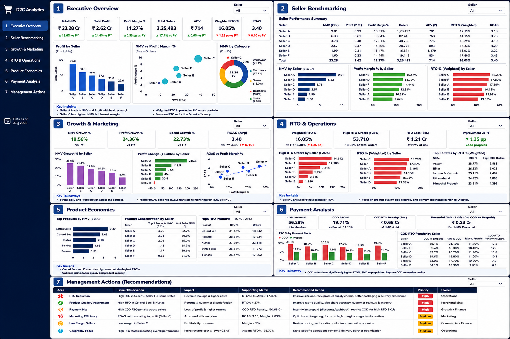

 # Multi-Seller D2C Growth & Profitability Analytics

  

Project Overview
This project analyzes a portfolio of 6 D2C sellers across profitability, growth, marketing efficiency, Return-to-Origin (RTO), payment behavior, and product concentration.

The objective is to move beyond isolated KPI reporting and build a management-level view of profitable growth and operational leakage.

 Business Questions
- Which sellers contribute the most NMV and profit?
- Which sellers have weak unit economics?
- How does RTO vary across sellers and states?
- Is COD associated with a higher RTO penalty?
- Does strong ROAS translate into stronger profitability?
- Where is product concentration highest?
- Which actions should management prioritize?

 Key KPIs
- NMV
- Profit
- Profit Margin %
- Orders
- AOV
- ROAS
- Weighted RTO %
- NMV Growth %
- Profit Change
- High-RTO Orders
- COD RTO %
- COD RTO Penalty
- Product Concentration

Dashboard
The interactive HTML dashboard contains 7 pages:
1. Executive Overview
2. Seller Benchmarking
3. Growth & Marketing
4. RTO & Operations
5. Product Economics
6. Payment Analysis
7. Management Actions

 Data Model
The project intentionally keeps datasets at their original analytical grain instead of flattening everything into one table.

| Dataset | Grain |
|---|---|
| Seller Master | One row per seller |
| Growth Trend | One row per seller |
| RTO Opportunity | One row per seller |
| State RTO Detail | Seller × State |
| Product Concentration | One row per seller |
| Payment Penalty | One row per seller |
| Payment Detail | Seller × Payment Mode |
| Priority Flags | Seller-level priority/status flags |

Tech Stack
- SQL
- Python
- Pandas
- Excel/CSV
- HTML
- CSS
- JavaScript

 Key Analytical Themes
- Seller scale versus profitability
- RTO-driven operational leakage
- COD versus non-COD performance
- Marketing efficiency versus profit quality
- Product concentration risk
- Management prioritization
